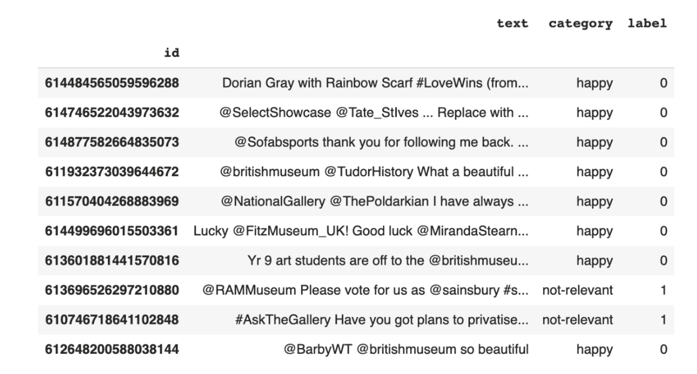

#  Sentiment Analysis using BERT

This is A presentation on 2024 spring Transformer  for final project. 

## Table of Contents  

1. [Motivation](#Motivation)  
2. [Overview](#Overview)  
3. [Data](#data)
4. [Model](#model)
5. [Main steps](#Main steps)
6. [Critical Analysis](#critical-analysis)
7. [result](#result)
8. [resources](#resources)

------

## Motivation

In this project, we chose Twitter as our data source for sentiment analysis due to its real-time nature and vast user base, which provide a rich and diverse dataset reflecting public sentiment towards current events. Our motivation for using the BERT model stems from its deep language understanding capabilities and bidirectional context analysis, making it particularly adept at handling the subtle nuances and ambiguities of natural language. Additionally, BERT's efficient fine-tuning and robust transfer learning capabilities allow us to quickly adapt to new data and complex sentiment classification tasks while maintaining high accuracy, making it an ideal tool for advanced sentiment analysis. These factors collectively motivated our choice of BERT to develop a high-performance multi-class sentiment classification model.

## Overview

This project involves developing a sentiment analysis model using the pre-trained BERT (Bidirectional Encoder Representations from Transformers) model to analyze sentiment on Twitter data. By leveraging the advanced capabilities of BERT within the PyTorch framework, this model is designed for multi-class classification, handling various sentiment categories to provide deeper insights into public opinion on social media.

Goals:

The primary goal of this project is to accurately classify the sentiment of tweets into multiple categories, thus providing nuanced insights into public sentiment. This involves conducting exploratory data analysis, preparing and encoding data using BERT's tokenizer, and setting up data loaders for efficient batch processing. The model aims to optimize performance metrics through careful training loops, utilizing optimizers and schedulers to fine-tune BERT's capabilities to the sentiment analysis task. Ultimately, the project seeks to demonstrate the effectiveness of BERT in real-world sentiment analysis applications, achieving high accuracy and robustness in classification performance.

------

## Data

We will use the SMILE Twitter dataset.The SMILE Twitter dataset, collected and annotated for analyzing public emotional responses to cultural experiences in museums, focuses on tweets related to British museums from May 2013 to June 2015. It contains 3,085 tweets categorized into five emotions: anger, disgust, happiness, surprise, and sadness. This dataset is ideal for sentiment analysis research within the specific context of arts and culture, providing a rich source for exploring public sentiment and contributing to better cultural policy-making and museum management practices

------

## Model

In this project, we employ the `bert-base-uncased` model from the `transformers` library as our foundation. We have fine-tuned this model on a dataset of tweets that have been labeled for emotion, specifically utilizing the SMILE emotion-annotated dataset. The fine-tuning process involves adjusting the pretrained BERT model to enhance its performance on sentiment analysis tasks tailored to the characteristics of the tweet data. The fine-tuning enables the model to more accurately understand and categorize the emotional expressions contained within tweets, effectively recognizing and classifying the sentiment conveyed in the dataset.

## Main steps

1. **Data Preprocessing**: Clean and format the SMILE dataset, including tokenizing and normalizing text to fit the input requirements of the `bert-base-uncased` model.
2. **Model Fine-Tuning**: Utilize the pre-trained `bert-base-uncased` model and fine-tune it on emotion-labeled tweets to adapt it better for the sentiment analysis task.
3. **Model Training**: Train the model on the processed data, adjusting parameters to optimize performance, such as learning rate and batch size adjustments.
4. **Model Evaluation**: Assess the performance of the model using the test dataset through

------

## Critical Analysis

**What needs to be improved for this model?**

The BERT-based sentiment analysis model may struggle with texts containing sarcasm, puns, and non-standard language such as slang and internet speak. These texts often have complex linguistic features and subtle emotional expressions that standard models might not accurately recognize. Additionally, the model may incorrectly interpret minor negative sentiments as neutral or positive due to insufficient or inaccurately labeled training data

**Solution**: To enhance the performance of a BERT-based sentiment analysis model, particularly for complex texts involving sarcasm, double entendres, and non-standard usage, consider the following improvements: Expand and diversify the training dataset to include more examples of complex text types, enhancing the model's generalization capability. Optimize data preprocessing and cleaning to ensure high-quality data, enabling more effective learning. Incorporate advanced architectural features or deeper semantic analysis techniques, such as context-aware semantic parsing, to better recognize subtle differences in text semantics. These strategies can significantly boost the model's efficiency and accuracy in analyzing complex text types.  .

## Result

After fine-tuning, the model achieves a notable accuracy in classifying tweets into their respective emotion categories

------

------

## Video Recording

Links to be added

------

## Resource

Alammar, J. (2018, December 3). The illustrated bert, elmo, and co. (how nlp cracked transfer learning). The Illustrated BERT, ELMo, and co. (How NLP Cracked Transfer Learning) — Jay Alammar — Visualizing machine learning one concept at a time. Retrieved September 15, 2021, from <https://jalammar.github.io/illustrated-bert/>.

Anastassiou, A. (n.d.). Sentiment Analysis with Deep Learning using BERT (MOOC). Coursera. <https://www.coursera.org/projects/sentiment-analysis-bert>.

Chaffey, D. (2021, July 23). Global social media statistics research summary [updated 2021]. Smart Insights. Retrieved September 16, 2021, from <https://www.smartinsights.com/social-media-marketing/social-media-strategy/new-global-social-media-research/>.

Devlin, J., Chang, M., Lee, K., & Toutanova, K. (2019). BERT: Pre-training of Deep Bidirectional Transformers for Language Understanding. NAACL. <https://arxiv.org/abs/1810.04805>.

Peters, M. E., Neumann, M., Iyyer, M., Gardner, M., Clark, C., Lee, K. & Zettlemoyer, L. (2018). Deep contextualized word representations (cite arxiv:1802.05365Comment: NAACL 2018.

Taylor, W. L. (1953). “Cloze procedure”: a new tool for measuring readability. Journalism Quarterly, 30, 415–433. <https://www.gwern.net/docs/psychology/writing/1953-taylor.pdf>.

